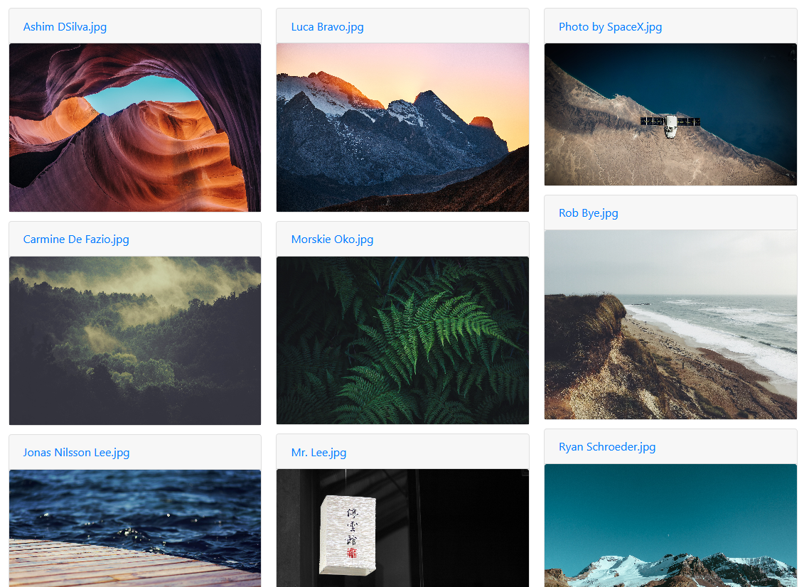

# IPFS Masonry

Provides an interface to display a [masonry](https://getbootstrap.com/docs/4.3/components/card/#card-columns) for images hosted on IPFS.
Images are lazy loaded to reduce the strain on the browser.
The galleries are also pinned to a local JS-IPFS node to help with the seeding.

## Customize

### Creating a gallery

You can clone this project and add a `/json/gallery.json` to display a custom gallery.

```json
{
  "author": "Elementary OS", // Title at the top of the page
  "description": "", // Description of the page
  "galleries": [
    {
      "cidv1": "bafybeicpr27fy2tffc3dxzrhjjsdzzblwjr6njxswejkpd3bsajhtmwfau", // CIDv1 of a gallery
      "title": "Wallpapers", // Name of the gallery
      "text": "", // Path to a `.md` file
      "folders": [
        {
          "path": ".", // Path of the folder
          "images": [ // Name of images
            "Ashim DSilva.jpg",
            "Carmine De Fazio.jpg",
            "Jonas Nilsson Lee.jpg",
            "leigh-kendell-581.jpg",
            "Luca Bravo.jpg",
            "Morskie Oko.jpg",
            "Mr. Lee.jpg",
            "Pablo Garcia Saldana.jpg",
            "Photo by SpaceX.jpg",
            "Rob Bye.jpg",
            "Ryan Schroeder.jpg",
            "Sunset by the Pier.jpg"
          ]
        }
      ]
    }
  ]
}
```

The `gallery.json` file can contain multiple galleries, and each of them can contain multiple folders.
A gallery is made of a CIDv1, a title, and the path to a markdown file.
A folder contains a path and the name of the contained images.

### Adding a gallery to IPFS

When adding files to IPFS, don't forget to convert the hash from CIDv0 to CIDv1.

```bash
ipfs cid base32 QmRj8ZPNJutRpDV2gekN3vtgXJxSLqLeNmMZL2oD6Khf4G
bafybeibskvkaunc5lwe6zhuvbcdqwcfrl3vrmq4xsbpxbpbrxpq6gbu6su
```

This is necessary to obtain subdomain-separated URLs. The only known gateway to support them for now is [cf-ipfs.com](https://blog.cloudflare.com/continuing-to-improve-our-ipfs-gateway/).

## Building

### Dependencies

To build this project, you need `hogan.js`.

```bash
npm i -g hogan.js
```

### Build

```bash
hulk mustache/* --outputdir templates
ipfs add -wr --chunker=rabin css images js json templates index.html robots.txt
```

The end result should look like this.



There's a preview available [here](https://bafybeidycoyxvsoswvs3dcbcr2twbb5j6kk4bhi3xsvxna4osujojam4oq.cf-ipfs.com).
